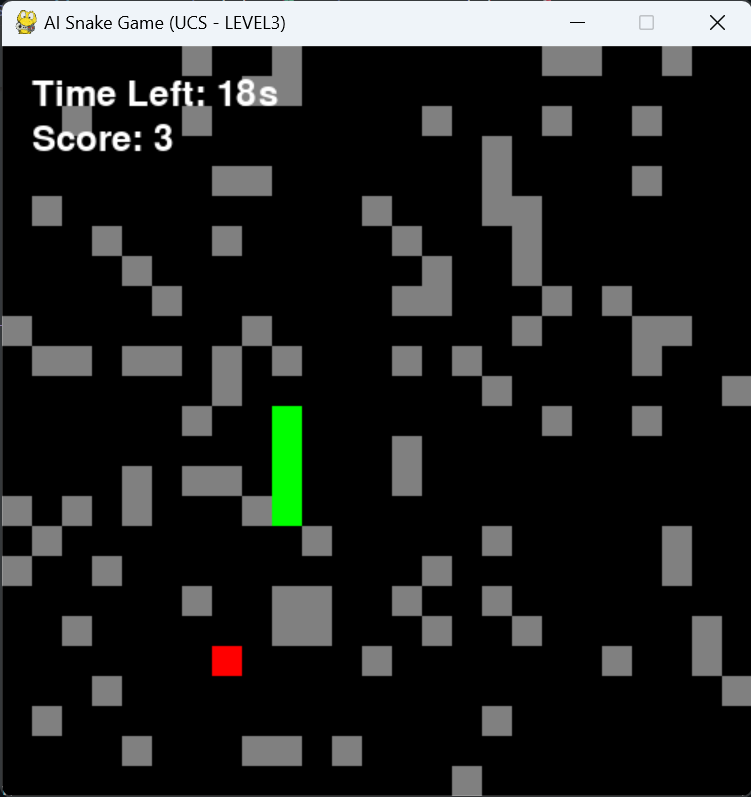

# 🐍 Snake AI Game

An **AI-powered Snake Game** built with **Python** and **Pygame**.  
The snake automatically plays the game using different **search algorithms** like BFS, DFS, UCS, IDS, Greedy Best First Search, A\*, and Random moves.

---

## 🎯 Features

- Multiple AI algorithms to control the snake:
  - **BFS** (Breadth First Search)
  - **DFS** (Depth First Search)
  - **UCS** (Uniform Cost Search)
  - **IDS** (Iterative Deepening Search)
  - **Greedy Best First Search**
  - **A\*** (A-Star Search)
  - **Random Move**
- Four difficulty levels with increasing number of obstacles.
- Timer-based gameplay (default 30s).
- Score tracking during play.

---

## 📂 Project Structure

snake-ai/
│
├── src/
│ ├── snake.py # Main game file
│ ├── search_algorithms.py # All pathfinding algorithms
│
├── requirements.txt # Dependencies
└── README.md # Project documentation

---

## 🚀 How to Run

1. **Clone the repository**

   ```bash
   git clone https://github.com/<your-username>/snake-ai.git
   cd snake-ai/src

   ```

2. **Install dependencies**
   pip install -r requirements.txt

3. **Run the game**
   python snake.py <level> <algorithm>

Levels:
level0 → No obstacles
level1 → 5% grid as obstacles
level2 → 10% grid as obstacles
level3 → 15% grid as obstacles

Algorithms:
bfs, dfs, ucs, ids, astar, greedy_bfs, random

🎮 Example Runs
python snake.py level0 bfs
python snake.py level2 astar
python snake.py level3 random

Output (in terminal when game ends):
Score: 13

🖼️ Screenshots





📊 Future Improvements
Add more AI algorithms (like Q-learning, Genetic Algorithm).
Save scores automatically in a file.
Support for human player vs AI.

👨‍💻 Author
Sandip Kumar Sah
